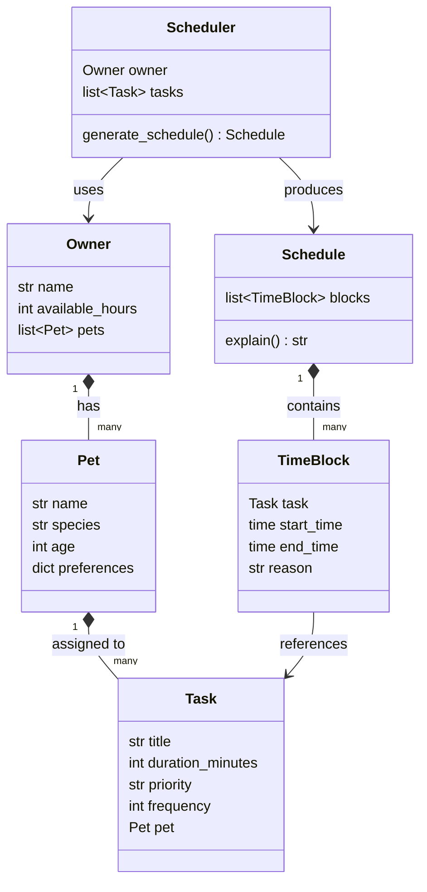

# Phase 1: Domain Models - Research

**Researched:** 2026-03-20
**Domain:** Python dataclasses, stdlib enum, Mermaid UML, pytest
**Confidence:** HIGH

---

<user_constraints>
## User Constraints (from CONTEXT.md)

### Locked Decisions

- `Pet.preferences` is an empty dict placeholder in Phase 1 — content will be populated in Phase 2+ when the scheduler needs to read it; use `field(default_factory=dict)` as the dataclass default
- Default task library implemented as a module-level function: `get_default_tasks(pet: Pet) -> list[Task]`
- `get_default_tasks` takes a Pet object; returns Task instances pre-assigned to that pet (real Task objects, not raw dicts)
- 6–8 tasks per species (dog and cat only — no "other")
- Tasks carry realistic priorities: mix of high/medium/low
- Some tasks have `frequency > 1` (e.g., feeding=2, water refresh=2) to exercise that model field
- Example dog tasks: morning walk, feeding (x2), water refresh (x2), evening walk, playtime, grooming
- Example cat tasks: feeding (x2), water refresh (x2), litter box, playtime, brushing, nail trim
- UML attributes + key methods shown (e.g., `generate_schedule()`, `explain()`, `get_default_tasks()`)
- UML lives in README.md as a new `## Class Diagram` section — format: one brief intro sentence + fenced Mermaid code block

### Claude's Discretion

- Priority representation: sort-map dict (`PRIORITY_ORDER = {"high": 0, "medium": 1, "low": 2}`) or `Priority` enum — either works, choose whichever makes Phase 2 comparisons cleaner
- Exact task durations in the default library (e.g., walk=30min, feeding=10min)
- Exact intro sentence wording for the UML section

### Deferred Ideas (OUT OF SCOPE)

None — discussion stayed within phase scope.
</user_constraints>

---

<phase_requirements>
## Phase Requirements

| ID | Description | Research Support |
|----|-------------|-----------------|
| MOD-01 | Pet dataclass with name, species (`"dog"` or `"cat"`), age, and preferences dict | `@dataclass` with `field(default_factory=dict)` for preferences; `__post_init__` can validate species |
| MOD-02 | Owner dataclass with name, available_hours (time budget), and pets list | `@dataclass` with `field(default_factory=list)` for pets; simple int for available_hours |
| MOD-03 | Task dataclass with title, duration_minutes, priority, frequency (times/day), and pet reference | `@dataclass` storing a `Pet` object reference for the pet field; frequency defaults to 1 |
| MOD-04 | Priority uses correct sort ordering (not raw string comparison) | `PRIORITY_ORDER` dict or `Priority` IntEnum both produce numeric sort keys; dict approach is simpler for Phase 2 `sorted()` key |
| LIB-01 | Default task library with common care tasks pre-loaded for dogs and cats | `get_default_tasks(pet: Pet) -> list[Task]` module-level function; raises `ValueError` for species other than dog/cat |
| DEL-02 | Mermaid UML class diagram in README | GitHub renders fenced ` ```mermaid ``` ` blocks natively; Mermaid `classDiagram` syntax covers attributes + methods + relationships |
</phase_requirements>

---

## Summary

Phase 1 is a pure-Python module-authoring task with no third-party dependencies beyond the Python standard library. The work centers on three `@dataclass` definitions (Pet, Owner, Task), a priority ordering mechanism, a default task library function, and a Mermaid class diagram in the README.

The existing `.venv` has Python 3.14.3 and pytest 9.0.2 already installed. There is no `models.py` yet, and no test files. The starter `app.py` is intentionally thin — it stores tasks as raw dicts in `st.session_state` and has a stubbed "Generate schedule" button. Phase 1 creates none of the Streamlit wiring; it only creates a standalone-importable `models.py`.

The single technical judgment call is priority representation. A `PRIORITY_ORDER = {"high": 0, "medium": 1, "low": 2}` dict is the recommended choice because Phase 2's `sorted()` call becomes `sorted(tasks, key=lambda t: PRIORITY_ORDER[t.priority])` — one line, no imports, easy to test. An `IntEnum` works equally well if the planner prefers a richer type, but adds no practical benefit at this scope.

**Primary recommendation:** Write `models.py` at the project root with three dataclasses plus `PRIORITY_ORDER` dict plus `get_default_tasks`, verify it is importable in a plain Python script, then add the Mermaid diagram to README.md.

---

## Standard Stack

### Core

| Library | Version | Purpose | Why Standard |
|---------|---------|---------|--------------|
| `dataclasses` (stdlib) | Python 3.7+ (3.14.3 in .venv) | Define Pet, Owner, Task with auto-generated `__init__`, `__repr__`, `__eq__` | Zero-dependency; assignment explicitly expects class design; `@dataclass` is idiomatic Python for value objects |
| `enum` (stdlib) | Python 3.4+ | Optional: `Priority` IntEnum for type-safe priority values | Only needed if choosing enum path over dict; same Python stdlib, no install |
| `pytest` | 9.0.2 (installed in .venv) | Unit tests for models and default task library | Already in requirements.txt and installed |

### Supporting

| Library | Version | Purpose | When to Use |
|---------|---------|---------|-------------|
| `dataclasses.field` | stdlib | `default_factory=dict` for preferences, `default_factory=list` for pets | Required for mutable defaults in dataclasses — never use `field={}` or `field=[]` directly |
| `__post_init__` | stdlib | Validate species is "dog" or "cat" at construction time | Optional but catches bad data early; raises `ValueError` with clear message |

### Alternatives Considered

| Instead of | Could Use | Tradeoff |
|------------|-----------|----------|
| `PRIORITY_ORDER` dict | `Priority(IntEnum)` | Enum gives `.HIGH`, `.MEDIUM`, `.LOW` names and blocks typos; dict is simpler and sufficient for this scope |
| Plain `@dataclass` | `@dataclass(frozen=True)` | Frozen makes objects immutable and hashable (good for dict keys); but Phase 2 may mutate tasks, so keep mutable |

**Installation:**

No new installs required — all dependencies already in `.venv`:
```bash
# Already installed:
# streamlit 1.55.0
# pytest 9.0.2
# Python 3.14.3
```

---

## Architecture Patterns

### Recommended Project Structure

```
pawpal-starter/
├── app.py            # Streamlit UI (existing — do not modify in Phase 1)
├── models.py         # Phase 1 output: Pet, Owner, Task, PRIORITY_ORDER, get_default_tasks
├── tests/
│   └── test_models.py  # Wave 0 gap — must create with Phase 1
├── requirements.txt  # existing (streamlit>=1.30, pytest>=7.0)
└── README.md         # add ## Class Diagram section with Mermaid block
```

### Pattern 1: Dataclass with Mutable Default via field()

**What:** Use `dataclasses.field(default_factory=...)` for any mutable default (list, dict). This is a stdlib requirement, not a style choice — assigning a mutable object directly as a default raises `ValueError` at class definition time.

**When to use:** Every field whose default is `[]` or `{}`

**Example:**
```python
# Correct — stdlib pattern for mutable defaults
from dataclasses import dataclass, field

@dataclass
class Pet:
    name: str
    species: str        # "dog" | "cat"
    age: int
    preferences: dict = field(default_factory=dict)

@dataclass
class Owner:
    name: str
    available_hours: int
    pets: list = field(default_factory=list)
```

### Pattern 2: Priority Sort Map

**What:** Module-level dict mapping string priority to an integer sort key. Phase 2 scheduler uses this in a `sorted()` key function.

**When to use:** Anywhere priority comparison is needed — sort, filter, display.

**Example:**
```python
# Correct — numeric sort keys prevent alphabetical ordering bug
PRIORITY_ORDER: dict[str, int] = {"high": 0, "medium": 1, "low": 2}

# Usage in Phase 2:
# sorted(tasks, key=lambda t: PRIORITY_ORDER[t.priority])
```

### Pattern 3: Task with Pet Reference

**What:** Task holds a direct reference to its Pet object (not pet name string, not pet ID). This allows the scheduler to label schedule output with `task.pet.name` without a lookup.

**When to use:** Always — per PROJECT.md class design and CONTEXT.md decision.

**Example:**
```python
@dataclass
class Task:
    title: str
    duration_minutes: int
    priority: str       # "high" | "medium" | "low"
    frequency: int = 1  # times per day
    pet: Pet = None     # set at construction time by get_default_tasks or caller
```

Note: `pet: Pet = None` is acceptable here because Task is always constructed with an explicit pet argument by `get_default_tasks`. If strict null safety is desired, `pet` can be required (no default), but then callers must always pass it.

### Pattern 4: get_default_tasks Function

**What:** Module-level function returning a list of fully-constructed Task objects for a given pet's species.

**When to use:** Phase 3 UI calls this when a new pet is added to pre-populate the task list.

**Example:**
```python
def get_default_tasks(pet: Pet) -> list[Task]:
    if pet.species == "dog":
        return [
            Task("Morning walk",    30, "high",   1, pet),
            Task("Feeding",         10, "high",   2, pet),
            Task("Water refresh",    5, "medium", 2, pet),
            Task("Evening walk",    30, "high",   1, pet),
            Task("Playtime",        20, "medium", 1, pet),
            Task("Grooming",        15, "low",    1, pet),
        ]
    elif pet.species == "cat":
        return [
            Task("Feeding",         10, "high",   2, pet),
            Task("Water refresh",    5, "medium", 2, pet),
            Task("Litter box",      10, "high",   1, pet),
            Task("Playtime",        15, "medium", 1, pet),
            Task("Brushing",        10, "low",    1, pet),
            Task("Nail trim",        5, "low",    1, pet),
        ]
    else:
        raise ValueError(f"No default tasks for species: {pet.species!r}")
```

### Pattern 5: Mermaid classDiagram in README

**What:** GitHub natively renders fenced ` ```mermaid ` blocks in Markdown. Use `classDiagram` syntax. Attributes use `Type fieldName`, methods use `returnType methodName()`.

**When to use:** DEL-02 requires this in README.md.

**Example:**
```markdown
## Class Diagram

The diagram below shows all six domain classes and their relationships.


```

Note: Only Pet, Owner, Task, and the `get_default_tasks` function are created in Phase 1. Scheduler, Schedule, and TimeBlock are shown in the diagram (DEL-02 requires all six classes) but are NOT implemented until Phase 2. The diagram can be committed in Phase 1 as a design artifact.

### Anti-Patterns to Avoid

- **Mutable default literals:** `pets: list = []` in a dataclass raises `ValueError` at class definition. Always use `field(default_factory=list)`.
- **String priority comparison:** `"high" > "medium"` is `False` because `"h" < "m"` alphabetically. Always use `PRIORITY_ORDER` to convert to int before comparing or sorting.
- **Putting models in app.py:** The critical constraint is that `import models` must work in a plain Python script without Streamlit. If Pet/Owner/Task are defined inside app.py, pytest tests will trigger Streamlit's runtime on import.
- **Using dataclass(frozen=True) prematurely:** Frozen dataclasses raise `FrozenInstanceError` on attribute assignment. Phase 2 may need to mutate tasks or schedule state — keep unfrozen for now.
- **Testing Streamlit session state:** `st.session_state` is not accessible outside a running Streamlit app. Tests must only import from `models.py`, never from `app.py`.

---

## Don't Hand-Roll

| Problem | Don't Build | Use Instead | Why |
|---------|-------------|-------------|-----|
| Auto-generated `__init__` / `__repr__` / `__eq__` | Custom `__init__` for each class | `@dataclass` decorator | Boilerplate is error-prone, brittle; dataclass handles field ordering, repr, equality automatically |
| Mutable default field values | `preferences = {}` as class attribute | `field(default_factory=dict)` | Python shares mutable class attributes across all instances — a classic bug that dataclasses explicitly prevent |
| Priority comparison logic | Custom `__lt__` on Task | `PRIORITY_ORDER` dict + stdlib `sorted()` | Sort keys are trivially testable; custom comparison methods are easy to get wrong |
| UML diagram rendering | Custom image/SVG | Mermaid in fenced code block | GitHub renders Mermaid natively; no tooling required |

**Key insight:** Phase 1 involves zero algorithmic complexity. The entire value is correct data structure definition — the right fields, the right defaults, the right priority representation. Complexity lives in Phase 2.

---

## Common Pitfalls

### Pitfall 1: Mutable Default Without field()

**What goes wrong:** `@dataclass` raises `ValueError: mutable default <class 'list'> for field pets is not allowed: use default_factory` at import time — before any test runs.

**Why it happens:** Python evaluates class bodies at definition time, not at instantiation. Every instance would share the same list object.

**How to avoid:** Use `field(default_factory=list)` for lists and `field(default_factory=dict)` for dicts — always.

**Warning signs:** `ValueError` on `import models` before any test body runs.

### Pitfall 2: Alphabetical Priority Comparison

**What goes wrong:** `sorted(tasks, key=lambda t: t.priority)` sorts "high" < "low" < "medium" alphabetically — wrong order for scheduling.

**Why it happens:** String comparison is alphabetical by default. "h" < "l" < "m" in ASCII.

**How to avoid:** Define `PRIORITY_ORDER = {"high": 0, "medium": 1, "low": 2}` at module level. The Phase 1 test should assert that `PRIORITY_ORDER["high"] < PRIORITY_ORDER["medium"] < PRIORITY_ORDER["low"]`.

**Warning signs:** A schedule that puts "low" priority tasks before "high" priority tasks.

### Pitfall 3: Circular Import via app.py

**What goes wrong:** If `models.py` imports anything from `app.py`, then `import models` triggers Streamlit's runtime, which calls `st.set_page_config` and crashes.

**Why it happens:** Streamlit's runtime must run inside a Streamlit session — calling it from pytest raises `StreamlitAPIException`.

**How to avoid:** `models.py` must import only from the Python standard library. No `import streamlit`, no `import app`.

**Warning signs:** `StreamlitAPIException` or `RuntimeError: Streamlit must be run from the command line` in pytest output.

### Pitfall 4: Task Constructed Without pet Argument

**What goes wrong:** If `pet` has no default and the caller omits it, Python raises `TypeError`. If `pet` defaults to `None` and the caller omits it, the task silently has no pet — Phase 2 scheduler crashes on `task.pet.name`.

**Why it happens:** API contract not enforced at construction time.

**How to avoid:** `get_default_tasks` always passes `pet` explicitly. Document the expectation clearly. Optionally add `__post_init__` validation: `if self.pet is None: raise ValueError("Task requires a pet")`.

**Warning signs:** `AttributeError: 'NoneType' object has no attribute 'name'` in Phase 2.

### Pitfall 5: Mermaid Syntax Errors Blocking Render

**What goes wrong:** GitHub renders a broken Mermaid diagram as raw text or shows a parse error — DEL-02 silently fails the visual requirement.

**Why it happens:** Mermaid syntax is strict: relationship arrows must use `-->`, `*--`, or `<|--`; multiplicity labels use `"1"` and `"many"` (quoted); generic type notation uses `~` not `<>`.

**How to avoid:** Test the diagram in the Mermaid Live Editor (https://mermaid.live) before committing. Common mistakes: unquoted multiplicity labels, using `<>` for generics instead of `~Pet~`.

**Warning signs:** Raw Mermaid code block visible in rendered README with no diagram.

---

## Code Examples

Verified patterns from stdlib documentation:

### Complete models.py skeleton

```python
# models.py — importable without Streamlit
from dataclasses import dataclass, field

PRIORITY_ORDER: dict[str, int] = {"high": 0, "medium": 1, "low": 2}


@dataclass
class Pet:
    name: str
    species: str        # "dog" | "cat"
    age: int
    preferences: dict = field(default_factory=dict)


@dataclass
class Owner:
    name: str
    available_hours: int
    pets: list = field(default_factory=list)


@dataclass
class Task:
    title: str
    duration_minutes: int
    priority: str       # "high" | "medium" | "low"
    frequency: int = 1
    pet: "Pet | None" = None


def get_default_tasks(pet: Pet) -> list[Task]:
    """Return pre-constructed Task objects for the given pet's species."""
    if pet.species == "dog":
        return [
            Task("Morning walk",  30, "high",   1, pet),
            Task("Feeding",       10, "high",   2, pet),
            Task("Water refresh",  5, "medium", 2, pet),
            Task("Evening walk",  30, "high",   1, pet),
            Task("Playtime",      20, "medium", 1, pet),
            Task("Grooming",      15, "low",    1, pet),
        ]
    elif pet.species == "cat":
        return [
            Task("Feeding",       10, "high",   2, pet),
            Task("Water refresh",  5, "medium", 2, pet),
            Task("Litter box",    10, "high",   1, pet),
            Task("Playtime",      15, "medium", 1, pet),
            Task("Brushing",      10, "low",    1, pet),
            Task("Nail trim",      5, "low",    1, pet),
        ]
    else:
        raise ValueError(f"No default tasks for species: {pet.species!r}")
```

### Basic pytest test structure for models

```python
# tests/test_models.py
import models


def test_pet_importable_without_streamlit():
    pet = models.Pet(name="Mochi", species="dog", age=3)
    assert pet.name == "Mochi"
    assert pet.preferences == {}


def test_priority_order_correct():
    assert models.PRIORITY_ORDER["high"] < models.PRIORITY_ORDER["medium"]
    assert models.PRIORITY_ORDER["medium"] < models.PRIORITY_ORDER["low"]


def test_get_default_tasks_dog_returns_tasks():
    pet = models.Pet("Rex", "dog", 2)
    tasks = models.get_default_tasks(pet)
    assert len(tasks) >= 6
    assert all(isinstance(t, models.Task) for t in tasks)
    assert all(t.pet is pet for t in tasks)


def test_get_default_tasks_dog_has_frequency_gt_1():
    pet = models.Pet("Rex", "dog", 2)
    tasks = models.get_default_tasks(pet)
    assert any(t.frequency > 1 for t in tasks)


def test_get_default_tasks_cat_returns_tasks():
    pet = models.Pet("Luna", "cat", 1)
    tasks = models.get_default_tasks(pet)
    assert len(tasks) >= 6
    assert all(t.pet is pet for t in tasks)


def test_get_default_tasks_unknown_species_raises():
    pet = models.Pet("Buddy", "other", 4)
    try:
        models.get_default_tasks(pet)
        assert False, "Expected ValueError"
    except ValueError:
        pass
```

---

## State of the Art

| Old Approach | Current Approach | When Changed | Impact |
|--------------|------------------|--------------|--------|
| Hand-written `__init__` / `__repr__` / `__eq__` | `@dataclass` decorator | Python 3.7 (PEP 557) | Eliminates boilerplate; auto-generated methods are correct by construction |
| `NamedTuple` for value objects | `@dataclass` | Python 3.7+ | Dataclass allows mutability, inheritance, and method addition; NamedTuple is immutable tuple subclass |
| `dict` for structured data | `@dataclass` | Python 3.7+ | Dataclass provides attribute access, type annotations, and IDE support |

**Deprecated/outdated:**

- `collections.namedtuple`: Still valid but `@dataclass` is preferred for mutable value objects with methods
- `class __slots__`: Micro-optimization irrelevant at this project scale

---

## Open Questions

1. **available_hours default value**
   - What we know: PROJECT.md says `available_hours: int` with no default; STATE.md flags "Available hours default value not confirmed"
   - What's unclear: Whether Owner should have a default (e.g., 8) or require the caller to always pass it
   - Recommendation: Require it explicitly (no default) in Phase 1 — Phase 3 will wire it to the UI input, which will always provide a value

2. **Task.pet as required vs optional field**
   - What we know: `get_default_tasks` always provides `pet`; but dataclass field ordering requires optional fields after required fields
   - What's unclear: Whether to make `pet` required (better safety) or optional with `None` default (simpler dataclass field order)
   - Recommendation: Use `pet: Pet = None` with optional default, document that `get_default_tasks` always fills it. If strict safety is desired, reorder fields so `pet` comes before fields with defaults — but this changes the constructor signature callers use.

---

## Validation Architecture

### Test Framework

| Property | Value |
|----------|-------|
| Framework | pytest 9.0.2 |
| Config file | None — Wave 0 gap (no pytest.ini or pyproject.toml in project root) |
| Quick run command | `python -m pytest tests/test_models.py -x` |
| Full suite command | `python -m pytest tests/ -v` |

Note: pytest must be invoked as `python -m pytest` (not bare `pytest`) when using the `.venv` to ensure the correct Python path. The `.venv` is at `.venv/` in the project root.

### Phase Requirements to Test Map

| Req ID | Behavior | Test Type | Automated Command | File Exists? |
|--------|----------|-----------|-------------------|-------------|
| MOD-01 | Pet dataclass with correct fields and dict default | unit | `python -m pytest tests/test_models.py::test_pet_importable_without_streamlit -x` | Wave 0 |
| MOD-02 | Owner dataclass with correct fields and list default | unit | `python -m pytest tests/test_models.py::test_owner_fields -x` | Wave 0 |
| MOD-03 | Task dataclass with all fields including pet reference | unit | `python -m pytest tests/test_models.py::test_task_fields -x` | Wave 0 |
| MOD-04 | Priority sort ordering (high < medium < low numerically) | unit | `python -m pytest tests/test_models.py::test_priority_order_correct -x` | Wave 0 |
| LIB-01 | get_default_tasks returns Task objects for dog and cat | unit | `python -m pytest tests/test_models.py::test_get_default_tasks_dog_returns_tasks tests/test_models.py::test_get_default_tasks_cat_returns_tasks -x` | Wave 0 |
| LIB-01 | Some tasks have frequency > 1 (exercises model field) | unit | `python -m pytest tests/test_models.py::test_get_default_tasks_dog_has_frequency_gt_1 -x` | Wave 0 |
| DEL-02 | Mermaid class diagram renders all six classes in README | manual | Open README.md on GitHub — verify diagram renders | N/A |

### Sampling Rate

- **Per task commit:** `python -m pytest tests/test_models.py -x`
- **Per wave merge:** `python -m pytest tests/ -v`
- **Phase gate:** Full suite green before `/gsd:verify-work`

### Wave 0 Gaps

- [ ] `tests/__init__.py` — empty file so pytest discovers the package (may not be needed with modern pytest but conventional)
- [ ] `tests/test_models.py` — covers MOD-01 through MOD-04, LIB-01 (all unit tests listed above)
- [ ] No pytest config file needed — pytest 9.0.2 discovers `tests/` by convention without configuration

---

## Sources

### Primary (HIGH confidence)

- Python stdlib docs: `dataclasses` module — https://docs.python.org/3/library/dataclasses.html — `@dataclass`, `field(default_factory=...)`, `__post_init__`
- Python stdlib docs: `enum` module — https://docs.python.org/3/library/enum.html — `IntEnum` pattern
- Project files read directly: `app.py`, `requirements.txt`, `README.md`, `.planning/PROJECT.md`, `.planning/REQUIREMENTS.md`, `.planning/phases/01-domain-models/01-CONTEXT.md`
- `.venv` inspection: Python 3.14.3, pytest 9.0.2, streamlit 1.55.0 confirmed installed

### Secondary (MEDIUM confidence)

- Mermaid classDiagram syntax: https://mermaid.js.org/syntax/classDiagram.html — attribute/method notation, relationship arrows, multiplicity labels
- GitHub Mermaid rendering: GitHub renders fenced ` ```mermaid ` blocks in Markdown files natively (confirmed in GitHub docs)

### Tertiary (LOW confidence)

- None — all critical claims verified against stdlib docs or project files directly

---

## Metadata

**Confidence breakdown:**

- Standard stack: HIGH — stdlib only; no third-party library decisions required; pytest and streamlit versions confirmed from .venv
- Architecture: HIGH — patterns sourced from Python stdlib docs and CONTEXT.md locked decisions
- Pitfalls: HIGH — `field(default_factory=...)` requirement is documented stdlib behavior; alphabetical string comparison is verifiable; circular import risk confirmed by reading app.py
- Mermaid syntax: MEDIUM — verified against mermaid.js.org docs; rendering on GitHub confirmed by GitHub documentation

**Research date:** 2026-03-20
**Valid until:** 2026-06-20 (stable stdlib — no meaningful change risk; Mermaid syntax changes slowly)
